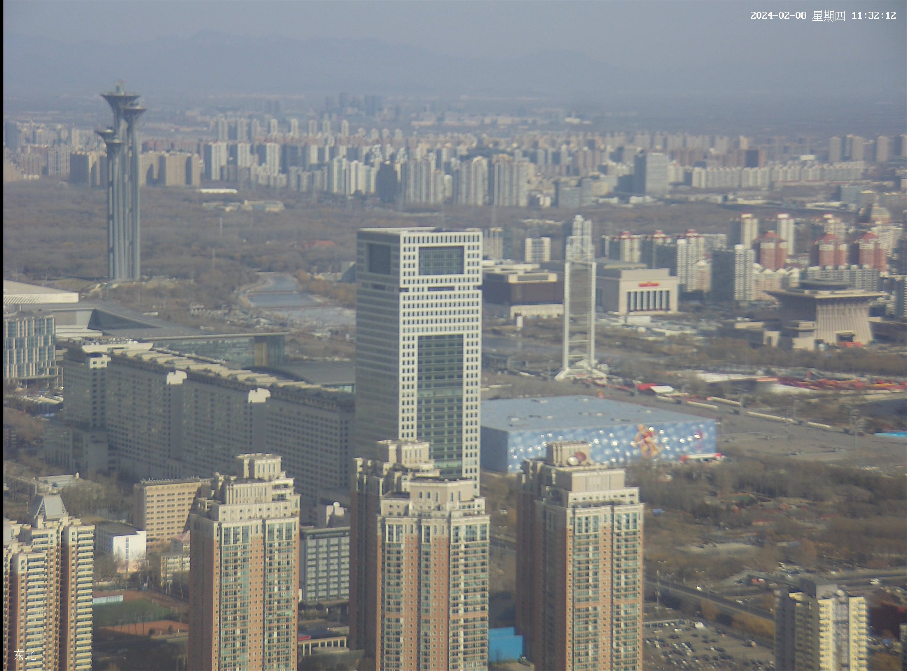
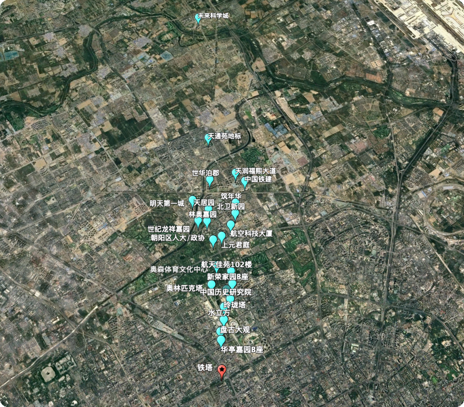
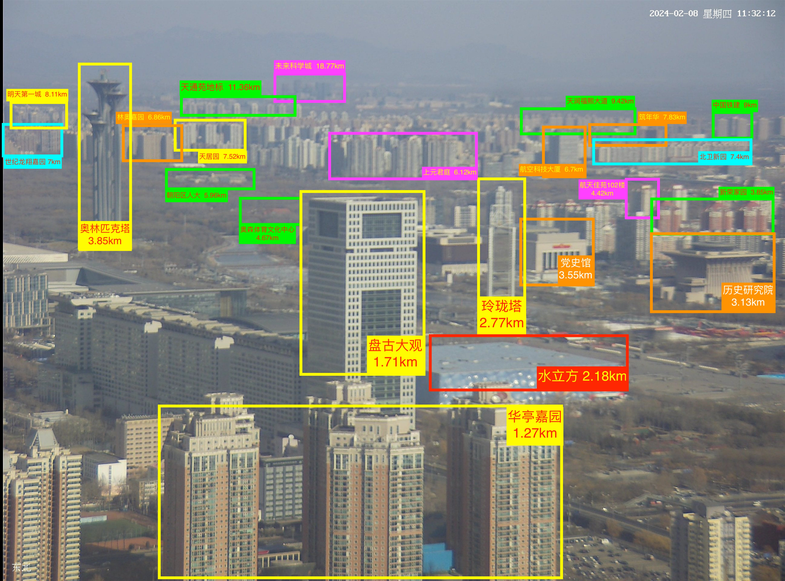
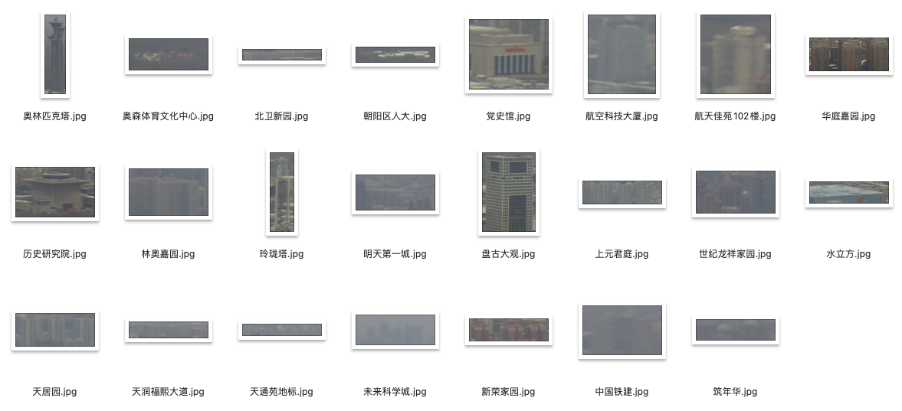
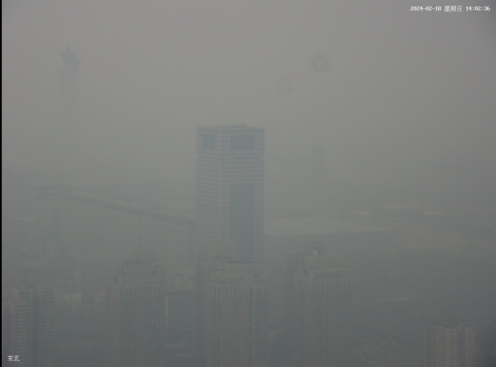

# tower-eye
本项目的主要工作是基于中科院大气物理研究所的[气象观测塔](http://view.iap.ac.cn:8080/imageview/)上的相机拍摄的照片反算能见度。


## 快速开始
要运行本项目，需要先将仓库克隆到本地
```bash
$ git clone https://github.com/caiyunapp/tower-eye.git
```
安装依赖
```bash
$ pip install -r requirements.txt
```
运行样例：
```bash
$ python towereye.py
基于 IAP 铁塔照片反算当前北京市的能见度为 19.0 km
```
如果想要测试其他时刻的照片，可以参考以下代码：
```python
from towereye import analysis_visibility

image_fp = "./iap-tower-camera.jpg"  # 替换为你下载的 IAP 铁塔的照片（须为东北方向）

visibility = analysis_visibility(image_fp)

print(f"基于 IAP 铁塔照片反算当前北京市的能见度为 {visibility} km")
```

## 原理介绍

### 人工测距
由于 IAP 的铁塔在拍摄方位上保持静止，因此我们首先借用 Google Earth 等相关工具以人工的方式对镜头中的建筑物进行测距。


使用 Google Earth 进行定位和测距


人工确定测距结果

## 分离物体
在完成了框选和测距以后，我们会将不同距离的建筑物从图片中分割出来。


各建筑物分离结果

## 清晰度分析
基于对不同能见度下图片的分析，我们认为在大雾状态下，远距离物体所呈现的色彩单一且集中，其主要特点是色彩谱宽窄且色差小。因此我们基于该理论，计算一个可见性的色彩判断评分：`灰度值标准差 * 灰度值谱宽`。根据实验，该评分大于250时，可以被判定为可见，低于250时，可以判定为不可见。

## 计算全图能见度
我们会基于这个判据来判断每个框选出的独立建筑物的可见性，而每个独立建筑物则代表其自身的能见度距离。我们只需要把所有框选出的建筑物的可见性计算出来，剔除掉不可见的建筑物后，在所有可见建筑后中取最大距离，即是最终的反算能见度。


大道至简，顶级的算法只需要最朴素的处理方式 🤫

## 不同能见度的识别效果
我们可以测试一下在不同能见度下 tower-eye 的识别效果，首先是高能见度：


图片存储位置：`./data/clear.jpg`

测试代码：
```python
from towereye import analysis_visibility
image_fp = "./data/clear.jpg"  # 替换为你下载的 IAP 铁塔的照片（须为东北方向）
visibility = analysis_visibility(image_fp)
print(f"基于 {image_fp} 识别的能见度为 {visibility} km")
```
返回的结果：
```
基于 ./data/clear.jpg 识别的能见度为 19.0 km
```

我们再测试一下大雾天气下的识别结果：

图片存储位置：`./data/fog.jpg`

将代码中的路径修改为大雾图片的路径后，识别的结果为：
```
基于 ./data/fog.jpg 识别的能见度为 2.0 km
```
